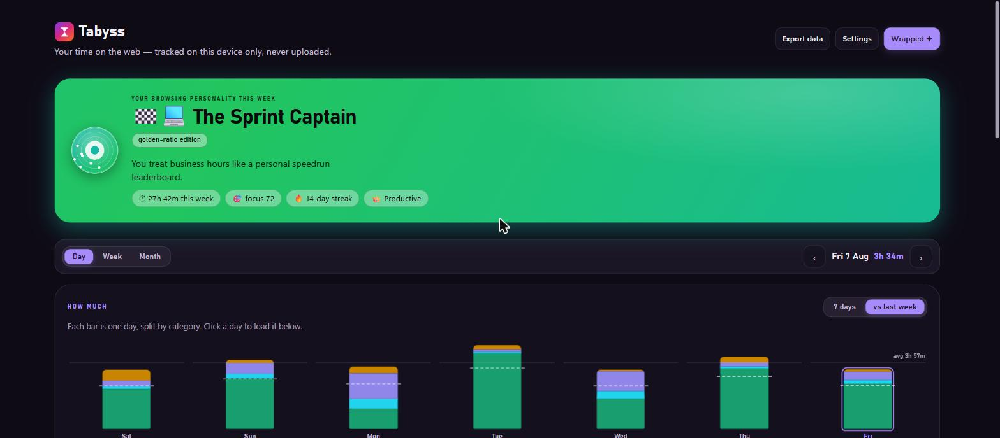
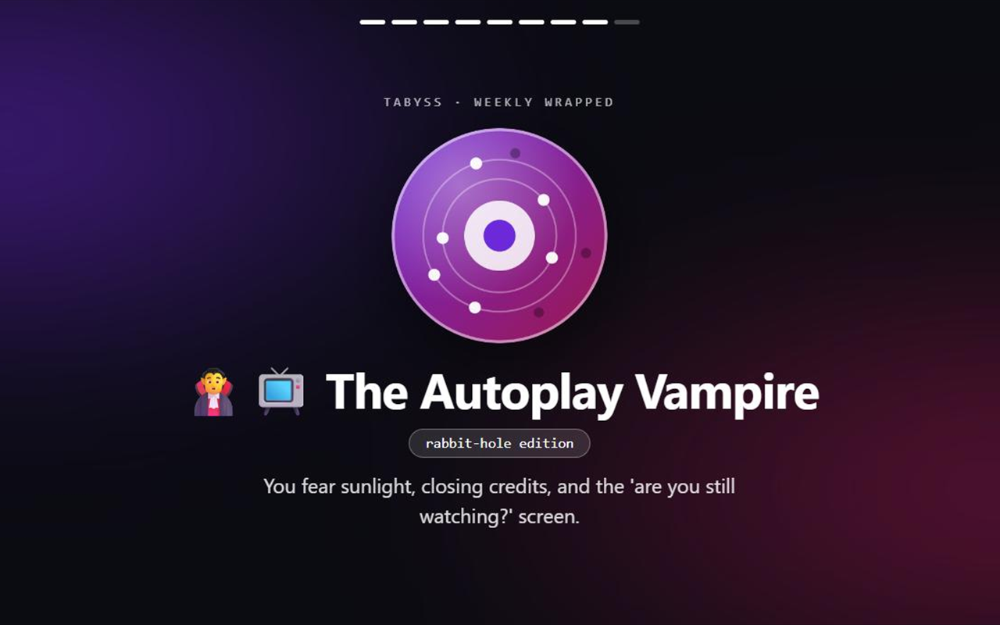
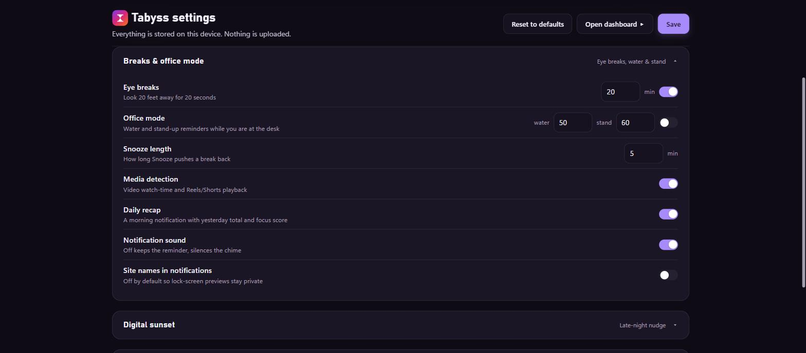

# ⏳ Tabyss — Know Your Scroll

[](https://microsoftedge.microsoft.com/addons/detail/bcnealjpndcccogjpceoaokeahmfdkha)
[](https://addons.mozilla.org/en-US/firefox/addon/tabyss-know-your-scroll/)

**A privacy-first browser extension for understanding your time, running a simple
session when it helps, and saving pages for later.** Browsing insights, optional
sessions, Saved pages,
wellbeing breaks, and a weekly Wrapped-style recap are computed
**entirely on your device**. No account. No server.
**Zero network requests.**

> Are you *The Autoplay Vampire*? *The 3AM Shipwright*? *The Timeline Landlord*?
> Tabyss watches how you actually browse and tells you who you are this week —
> with unique generative artwork for every persona.



<p align="center">
  
  
</p>



## Features

| | |
|---|---|
| 🔖 **Saved pages** | Save the current page with an optional note, then open, complete, save again, filter, or delete it from one accessible side panel; site favicons come from Chrome's local cache |
| ✅ **Optional intentional sessions** | Enter what you are doing, see the local domains visited, then pause, extend, Complete, or End directly in one click |
| 🎭 **Browsing Personality** | 50+ personas from 6 archetypes × 4 rhythms × 4 intensities, computed weekly from real patterns, each with deterministic generative avatar art |
| ✨ **Weekly Wrapped** | A 9-slide full-screen recap with a locally rendered 1080×1080 share card (categories only by default — sites are opt-in) |
| 🎯 **Focus Score** | Daily 0–100 from productive share + tab discipline − rabbit holes; honest "warming up" state under 30 minutes |
| 🎬 **Media detection** | Video watch-time and Shorts/Reels measured separately by a content script, both requiring real playback — normal reading never counts |
| 👀 **20-20-20 eye breaks** | A desktop notification after continuous screen time, with Done and Snooze, so it reaches you even when the browser is not in front |
| 🏢 **Office Mode** | Hydration and stand-up reminders on wall-clock cycles, presence-gated so an empty desk is never nagged |
| 🔥 **Streaks & badges** | 30m+ productive days build streaks (one rest day forgiven); 12 unlockable badges |
| 🗂 **Auto-categorization** | Bundled offline catalog (~250 domains) + boundary-safe rules + keyword heuristics across 8 categories; user overrides always win |
| 📊 **Full dashboard** | Day/week/month scope, a day-by-day chart stacked by category with a daily average line and same-weekday-last-week comparison, category donut, hour heatmap, calendar and per-site favicons |

Appearance is also under your control: Settings offers **System, Light, and Dark**
using the Abyss & Ember design language. System follows the device, and the choice
never leaves local extension storage.

## Engineering highlights

Built as a **Manifest V3** extension with no frameworks and no external dependencies —
every line of UI, tracking, and artwork is hand-rolled:

- **Event-driven tracking engine** on a service worker that survives suspension:
  1-minute alarm heartbeat + tab/window/idle events, with wall-clock gap detection
  so machine sleep never inflates a day.
- **Restart-safe focus state machine** — the active session is persisted, elapsed
  time is derived from timestamps, and one alarm is used only as a wake-up hint;
  timer expiry opens review instead of falsely claiming completion.
- **Serialized storage transactions** — all read-modify-write cycles run through a
  promise-chain mutex after a review found flush/maintenance races that could
  silently erase committed data.
- **Honest edge-case handling**: audible tabs count as active (a Netflix binge is
  not "idle"), same-site runs break across sleep gaps instead of stitching into
  fake 25-minute rabbit holes, and pre-switch-data days score with neutral credit.
- **Domain-boundary-safe categorization** — naive substring matching filed
  `netflix.com` under Social because it contains `x.com`; the matcher now respects
  hostname label boundaries, with an exact-entry catalog beating base-domain
  fallbacks (`news.google.com` → News even though `google.com` → Productive).
- **Deterministic persona + doodle engine** — seeded PRNG (mulberry32 over a string
  hash of persona + week) draws avatar art from the stats themselves: orbit dots =
  active days, voids = rabbit holes, core size = focus score.
- **Evidence-only media classification** — a kind is recorded only with a real
  `<video>` element playing, checked for size and visibility. Feed-scroll
  inference was removed: it matched five exact feed URLs, so any other feed
  recorded zero while the figure still read as complete.
- **Privacy as architecture**: no `history` permission, no remote code, no
  telemetry, favicon rendering via Chrome's local cache, and a share card that
  excludes site names unless explicitly enabled. Incognito activity is excluded,
  raw storage is restricted to trusted extension contexts, and runtime messages
  are allowlisted by sender type.
- **Explicit capture boundary**: normal analytics remain domain-only. Full URL/title
  metadata is retained only when the user explicitly saves a page, and remains
  inside local extension storage. Legacy V2 preview records remain exportable but
  are not active product surfaces.

## Test

Run the dependency-free security and data-contract suite:

```powershell
node --test tests/*.test.js
```

Run the complete local/CI gate, including deterministic packaging:

```powershell
powershell -NoProfile -ExecutionPolicy Bypass -File .\verify.ps1
```

For a local visual smoke test of the real Settings or Saved pages HTML/CSS/JS without installing
the extension, run `node tests/ui-server.js` and open
`http://127.0.0.1:4173/options.html` or `/sidepanel.html`. The adapter is test-only and is not included
by `package.ps1`. The unpacked-extension checklist remains the release authority.

Create the Chrome Web Store ZIP with `package.ps1`. Its exact runtime whitelist
lives in `package-files.json`; timestamps and entry order are fixed so identical
source produces an identical archive on the supported build runner. Pass
`-OutputPath path.zip` to avoid replacing the default local artifact.

## Install

**Microsoft Edge** — [Add to Edge](https://microsoftedge.microsoft.com/addons/detail/bcnealjpndcccogjpceoaokeahmfdkha)
**Firefox** — [Add to Firefox](https://addons.mozilla.org/en-US/firefox/addon/tabyss-know-your-scroll/)

**From source (2 minutes):**
1. Clone this repo
2. Open `edge://extensions` (or `chrome://extensions`) → enable **Developer mode**
3. **Load unpacked** → select the repo folder

## Privacy

Tabyss makes **zero network requests** — verifiable in the source: there is no
`fetch`, no `XMLHttpRequest`, no remote script, no analytics SDK. All data lives in
`chrome.storage.local` with user-configurable retention, full export/import, and
one-click deletion. See [PRIVACY.md](PRIVACY.md).

## Project docs

| Doc | Purpose |
|---|---|
| [PRD.md](PRD.md) | Product requirements and design decisions of record |
| [CHANGELOG.md](CHANGELOG.md) | Full version history v1.0 → v2.0 |
| [QA_CHECKLIST.md](QA_CHECKLIST.md) | Release test pass |
| [STORE_LISTING.md](STORE_LISTING.md) / [EDGE_SUBMISSION.md](EDGE_SUBMISSION.md) | Store submission kits |
| [PRIVACY.md](PRIVACY.md) | Privacy policy |

## Stack

Vanilla JavaScript (MV3 service worker + content script), hand-rolled SVG/Canvas
visualization (donut, heatmaps, rings, generative art), CSS custom properties with
System/Light/Dark theming, PowerShell build script. **No frameworks, no build step,
no dependencies.**

## License

MIT — see [LICENSE](LICENSE).
